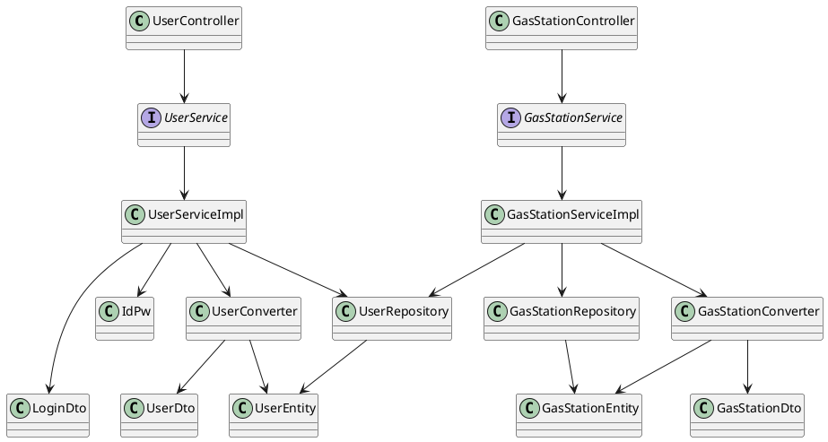

# Integration and API Test Documentation

Authors:

Date:

Version:

# Contents

- [Dependency graph](#dependency graph)

- [Integration and API Test Documentation](#integration-and-api-test-documentation)
- [Contents](#contents)
- [Dependency graph](#dependency-graph)
- [Integration approach](#integration-approach)
- [Tests](#tests)
  - [Step 1](#step-1)
  - [Step 2](#step-2)
  - [Step n API Tests](#step-n-api-tests)
- [Scenarios](#scenarios)
  - [Scenario UCx.y](#scenario-ucxy)
- [Coverage of Scenarios and FR](#coverage-of-scenarios-and-fr)
- [Coverage of Non Functional Requirements](#coverage-of-non-functional-requirements)
    - 

- [Tests](#tests)

- [Scenarios](#scenarios)

- [Coverage of scenarios and FR](#scenario-coverage)
- [Coverage of non-functional requirements](#nfr-coverage)

# Dependency graph 

     
# Integration approach

    <Write here the integration sequence you adopted, in general terms (top down, bottom up, mixed) and as sequence
    (ex: step1: class A, step 2: class A+B, step 3: class A+B+C, etc)> 
    <The last integration step corresponds to API testing at level of Service package>
    <Tests at level of Controller package will be done later>

#  Tests

## Step 0
| Classes  | JUnit test cases |
|--|--|
|User , UserDto| unit tests|
|GasStation, GasStationDto| unit tests|

## Step 1
| Classes  | JUnit test cases |
|--|--|
|UserConverter ,GasStationConverter| it.polito.ezgas.UserConverterTest, it.polito.ezgas.GasStationConverterTest|
|UserRepository, GasStationRepository| it.polito.ezgas.UserRepositoryTest, it.polito.ezgas.GasStationRepositoryTest|

## Step 2
| Classes  | JUnit test cases |
|--|--|
|UserService | it.polito.ezgas.UserServiceTest|
|GasStationService| it.polito.ezgas.GasStationServiceTest|

## Step 3 API Tests

| Classes  | JUnit test cases |
|--|--|
|UserService | it.polito.ezgas.UserServiceAPITest|
|GasStationService| it.polito.ezgas.GasStationServiceAPITest|

# Scenarios

<If needed, define here additional scenarios for the application. Scenarios should be named
 referring the UC they detail>

## Scenario UCx.y

| Scenario |  name |
| ------------- |:-------------:| 
|  Precondition     |  |
|  Post condition     |   |
| Step#        | Description  |
|  1     |  ... |  
|  2     |  ... |

# Coverage of Scenarios and FR

<Report in the following table the coverage of  scenarios (from official requirements and from above) vs FR. 
Report also for each of the scenarios the (one or more) API JUnit tests that cover it. >

| Scenario ID | Functional Requirements covered | JUnit  Test(s) | 
| ----------- | ------------------------------- | ----------- | 
|  ..         | FR1.1                            |             |             
|  ..         | FR1.2                             |             |             
| ...         | FR1.3                               |             |             
| ...         | FR1.4                               |             |             
| ...         | FR3.1                               |             |             
| ...         | FR3.2                               |             |
|             | FR3.3                               |    |  
|             | FR4.1                               |              |
|             | FR4.2                               |              |
|             | FR4.3                               |              |
|             | FR4.5                               |            |
|             | FR3.1 FR5.1                         |              |
|             | FR5.2                               |              |
|             | FR5.3                               |              |

# Coverage of Non Functional Requirements

<Report in the following table the coverage of the Non Functional Requirements of the application - only those that can be tested with automated testing frameworks.>

### 

| Non Functional Requirement | Test name |
| -------------------------- | --------- |
|                            |           |

