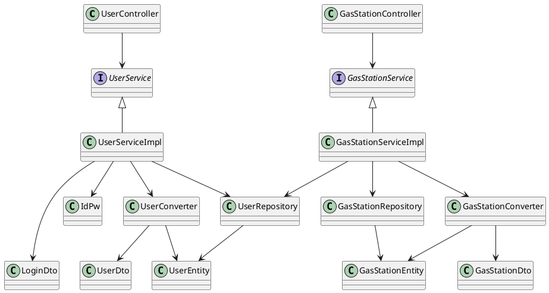

# Integration and API Test Documentation

Authors:

Date:

Version:

# Contents

- [Dependency graph](#dependency graph)

- [Integration and API Test Documentation](#integration-and-api-test-documentation)
- [Contents](#contents)
- [Dependency graph](#dependency-graph)
- [Integration approach](#integration-approach)
- [Tests](#tests)
  - [Step 1](#step-1)
  - [Step 2](#step-2)
  - [Step n API Tests](#step-n-api-tests)
- [Scenarios](#scenarios)
  - [Scenario UC4.1](#scenario-uc41)
  - [Scenario UC5.1](#scenario-uc51)
  - [Scenario UC6.1](#scenario-uc61)
- [Coverage of Scenarios and FR](#coverage-of-scenarios-and-fr)
- [Coverage of Non Functional Requirements](#coverage-of-non-functional-requirements)
    - 

- [Tests](#tests)

- [Scenarios](#scenarios)

- [Coverage of scenarios and FR](#scenario-coverage)
- [Coverage of non-functional requirements](#nfr-coverage)

# Dependency graph 

     
# Integration approach

    <Write here the integration sequence you adopted, in general terms (top down, bottom up, mixed) and as sequence
    (ex: step1: class A, step 2: class A+B, step 3: class A+B+C, etc)> 
    <The last integration step corresponds to API testing at level of Service package>
    <Tests at level of Controller package will be done later>

#  Tests

## Step 0
| Classes  | JUnit test cases |
|--|--|
|User , UserDto| unit tests|
|GasStation, GasStationDto| unit tests|

## Step 1
| Classes  | JUnit test cases |
|--|--|
|UserConverter ,GasStationConverter| it.polito.ezgas.UserConverterTest, it.polito.ezgas.GasStationConverterTest|
|UserRepository, GasStationRepository| it.polito.ezgas.UserRepositoryTest, it.polito.ezgas.GasStationRepositoryTest|

## Step 2
| Classes  | JUnit test cases |
|--|--|
|UserService | it.polito.ezgas.UserServiceTest|
|GasStationService| it.polito.ezgas.GasStationServiceTest|

## Step 3 API Tests

| Classes  | JUnit test cases |
|--|--|
|UserService | it.polito.ezgas.UserServiceAPITest|
|GasStationService| it.polito.ezgas.GasStationServiceAPITest|

# Scenarios

<If needed, define here additional scenarios for the application. Scenarios should be named
 referring the UC they detail>

## Scenario UC1.1

| Scenario |  Create User Account with a valid email|
| ------------- |:-------------:| 
|  Precondition     | Account U does not exist |
|  Post condition     |  Account U added in the system |
| Step#        | Description  |
|  1     |  New User fill the new account fields and submit them |
| 2      |  Check that there isn't yet an account associated with that email |  
|  3     |  The account is added in the system with trust level = 0 and an autogenerated id|

## Scenario UC1.2

| Scenario |  Create User Account with an invalid email|
| ------------- |:-------------:| 
|  Precondition     | Account U does not exist |
|  Post condition     |  Account U not added in the system |
| | U.trust_level=0 |
| Step#        | Description  |
|  1     |  New User fill the new account fields and submit them |
| 2      |  Check that there already is an account associated with that email |  
|  3     |  The account is not added in the system |

## Scenario UC1.3

| Scenario |  Admin creates a new User Account with a valid email|
| ------------- |:-------------:| 
|  Precondition       | Account U does not exist |
|  Post condition     |  Account U added in the system |
|                     | U.trust_level=0 |
| Step#        | Description  |
|  1     |  Admin fill the new account fields and submit them |
|  2     |  Check that there isn't yet an account associated with that email |  
|  3     |  The account is added in the system with U.trust_level=0  |

## Scenario UC1.4

| Scenario |  Admin creates a new User Account with an invalid email|
| ------------- |:-------------:| 
|  Precondition       | Account U does not exist |
|  Post condition     |  Account U added in the system |
|                     | U.trust_level=0 |
| Step#        | Description  |
|  1     |  Admin fill the new account fields and submit them |
|  2     |  Check that there already is an account associated with that email |  
|  3     |  The account is not added in the system   |

## Scenario UC2.1

| Scenario |  User updates his Account|
| ------------- |:-------------:| 
|  Precondition       | Account U  exist |
|  Post condition     |  Account U updated |
| Step#        | Description  |
|  1     |  User fill the new fields about his account and submit them |
|  2     |  The account is updated  |

## Scenario UC2.2

| Scenario |  Admin updates an User Account|
| ------------- |:-------------:| 
|  Precondition       | Account U  exist |
|  Post condition     |  Account U updated |
| Step#        | Description  |
|  1     |  Admin chooses the user to update|
|  2     |  Admin fills the new fields and submit them |
|  2     |  The account is updated  |

## Scenario UC3.1

| Scenario |  User deletes his Account|
| ------------- |:-------------:| 
|  Precondition       | Account U  exist |
|  Post condition     |  Account U deleted from the system |
| Step#        | Description  |
|  1     |  User deletes his account|
|  2     |  The account is deleted  |

## Scenario UC3.2

| Scenario |  Admin deletes an User Account|
| ------------- |:-------------:| 
|  Precondition       | Account U  exist |
|  Post condition     |  Account U deleted from the system |
| Step#        | Description  |
|  1     | Admin chooses the User account to delete|
|  2     |  The account is deleted  |

## Scenario UC4.1

| Scenario |  name |
| ------------- |:-------------:| 
|  Precondition     | Gas Station GS does not exist |
|  Post condition     |  Gas Station GS created |
| Step#        | Description  |
|  1     |  The administrator tells the system he wants to create a new GS |  
|  2     |  All fields of GS are compiled |
|  3     |  The GS received a unique ID   |
|  4     |  GS created and available      |

## Scenario UC5.1

| Scenario |  name |
| ------------- |:-------------:| 
|  Precondition     | Gas Station GS exists |
|  Post condition     |  Gas Station GS modified |
| Step#        | Description  |
|  1     |  The administrator selects a GS |
|  2     |  The administrator tells the system he wants to modify the GS  |  
|  3     |  All fields of GS are re-compiled |
|  4     |  GS updated         |

## Scenario UC6.1

| Scenario |  name |
| ------------- |:-------------:| 
|  Precondition     | Gas Station GS exists |
|  Post condition     |  Gas Station GS deleted |
| Step#        | Description  |
|  1     |  The administrator selects a GS |
|  2     |  The administrator tells the system he wants to delete the GS  |   
|  3     |  GS deleted         |

# Coverage of Scenarios and FR

<Report in the following table the coverage of  scenarios (from official requirements and from above) vs FR. 
Report also for each of the scenarios the (one or more) API JUnit tests that cover it. >

| Scenario ID | Functional Requirements covered | JUnit  Test(s) | 
| ----------- | ------------------------------- | ----------- | 
|  ..         | FR1.1                            |             |             
|  ..         | FR1.2                             |             |             
| ...         | FR1.3                               |             |             
| ...         | FR1.4                               |             |             
| ...         | FR3.1                               |             |             
| ...         | FR3.2                               |             |
|             | FR3.3                               |    |  
<<<<<<< HEAD
|             | FR4.1                               |              |
|             | FR4.2                               |              |
|             | FR4.3                               |              |
|             | FR4.5                               |            |
|             | FR3.1 FR5.1                         |              |
|             | FR5.2                               |              |
|             | FR5.3                               |              |

=======
|             |           
| UC1.1       |   FR1.1,FR1.4                   | it.polito.ezgas.UserServiceAPITests.TC1_saveUser, it.polito.ezgas.UserServiceTests.TC1_saveUser,it.polito.ezgas.UserRepositoryTests.TestfindByEmail  |
| UC1.2       |   FR1.1,FR1.4                   | it.polito.ezgas.UserServiceAPITests.TC2_saveUser, it.polito.ezgas.UserServiceTests.TC2_saveUser,it.polito.ezgas.UserRepositoryTests.TestfindByEmail |
| UC1.3       |   FR1.1, FR1.3, FR1.4           | it.polito.ezgas.UserServiceAPITests.TC1_saveUser, it.polito.ezgas.UserServiceTests.TC1_saveUser,it.polito.ezgas.UserRepositoryTests.TestfindByEmail |
| UC1.4       |   FR1.1, FR1.3, FR1.4           | it.polito.ezgas.UserServiceAPITests.TC2_saveUser, it.polito.ezgas.UserServiceTests.TC2_saveUser,it.polito.ezgas.UserRepositoryTests.TestfindByEmail |
| UC2.1       |   FR1.1                         | it.polito.ezgas.UserServiceAPITests.TC3_saveUser, it.polito.ezgas.UserServiceTests.TC3_saveUser |
| UC2.2       |   FR1.1, FR1.3, FR1.4           | it.polito.ezgas.UserServiceAPITests.TC3_saveUser, it.polito.ezgas.UserServiceTests.TC3_saveUser,it.polito.ezgas.UserRepositoryTests.TestfindByEmail |
| UC3.1       |   FR1.2                         | it.polito.ezgas.UserServiceAPITests.TC1_deleteUser, it.polito.ezgas.UserServiceTests.TC1_deleteUser |
| UC3.2       |   FR1.2, FR1.3, FR1.4           | it.polito.ezgas.UserServiceAPITests.TC1_deleteUser, it.polito.ezgas.UserServiceTests.TC1_deleteUser, it.polito.ezgas.UserRepositoryTests.TestfindByEmail |
>>>>>>> f3bc9285eb6621a5937256afb2b517790a56d6a8

# Coverage of Non Functional Requirements

<Report in the following table the coverage of the Non Functional Requirements of the application - only those that can be tested with automated testing frameworks.>

### 

| Non Functional Requirement | Test name |
| -------------------------- | --------- |
|                            |           |

