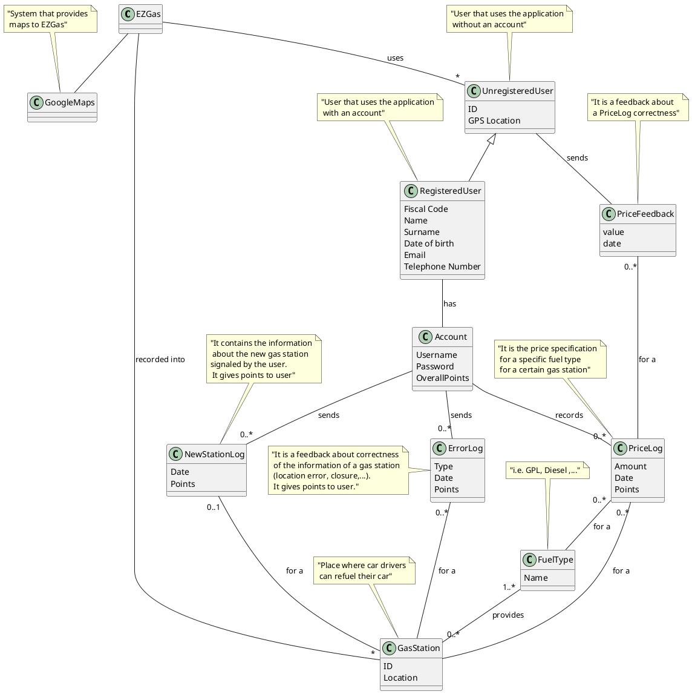

# Requirements Document 

Authors:

Date:

Version:

# Contents

- [Abstract](#abstract)
- [Stakeholders](#stakeholders)
- [Context Diagram and interfaces](#context-diagram-and-interfaces)
	+ [Context Diagram](#context-diagram)
	+ [Interfaces](#interfaces) 
	
- [Requirements Document](#requirements-document)
- [Contents](#contents)
- [Abstract](#abstract)
- [Stakeholders](#stakeholders)
- [Context Diagram and interfaces](#context-diagram-and-interfaces)
	- [Context Diagram](#context-diagram)
	- [Interfaces](#interfaces)
- [Stories and personas](#stories-and-personas)
- [Functional and non functional requirements](#functional-and-non-functional-requirements)
	- [Functional Requirements](#functional-requirements)
	- [Non Functional Requirements](#non-functional-requirements)
- [Use case diagram and use cases](#use-case-diagram-and-use-cases)
	- [Use case diagram](#use-case-diagram)
		- [Use case 1, UC1](#use-case-1-uc1)
				- [Scenario 1.1](#scenario-11)
				- [Scenario 1.2](#scenario-12)
				- [Scenario 1.3](#scenario-13)
		- [Use case 2, UC2](#use-case-2-uc2)
				- [Scenario 2.1](#scenario-21)
		- [Use case 3, UC3](#use-case-3-uc3)
				- [Scenario 3.1](#scenario-31)
		- [Use case 4, UC4](#use-case-4-uc4)
				- [Scenario 4.1](#scenario-41)
		- [Use case](#use-case)
- [Glossary](#glossary)
- [System Design](#system-design)
- [Deployment Diagram](#deployment-diagram)

# Abstract

Since cars have been invented, car owners have had the need to refill the fuel tank in order to make them move. Sometimes you know where you are goning to refuels, sometimes you don't. If you're travelling a long distance it will happen that you need to find a gas station, and probably you want to find the cheapest near. Car drivers need to know the different prices and precise position of gas stations in their neighboring area or in the middle of their road. In order to do this, they use EZGas that allow to:

1 - collect prices of fuels in different gas stations;
2 - locate gas stations in an area.

Each user can use the app also to send a feedback about reliability of informations of a specific gas station. If a user has also a registered account, he can set a new price for a specific fuel type for a certain gas station and possibly its location. By doing this, the registered user can collect point to obtain coupon. Moreover, a registered user can have a list of its favourite gas stations and receive a notifications if changes occur to those gas stations.


# Stakeholders


| Stakeholder name  | Description | 
| ----------------- |:-----------:|
| Unregistered User	|Can find a gas station based on its location or prices. Can also send a feedback about correctness of gas station data| 
| Registered User 	| Can insert/delete gas station and insert/modify fuel price. By doing this, it collects points to obtain coupon| 
| GoogleMaps	    |External service used to map user and gas stations|


# Context Diagram and interfaces

## Context Diagram
\<Define here Context diagram using UML use case diagram>

\<actors are a subset of stakeholders>

```plantuml
left to right direction
actor "Unregistered User" as uu
actor "Registered User" as ru
actor GoogleMaps as gm
uu -- (EZGas) 
ru -- (EZGas)
gm <=> (EZGas)
```

## Interfaces
\<describe here each interface in the context diagram>

\<GUIs will be described graphically in a separate document>

| Actor | Logical Interface | Physical Interface  |
| ------------- |:-------------:| -----:|
| User (both types)	| GUI |Touchscreen     |
| GoogleMaps	    | API |Internet        |

# Stories and personas
\<A Persona is a realistic impersonation of an actor. Define here a few personas and describe in plain text how a persona interacts with the system>

\<Persona is-an-instance-of actor>

\<stories will be formalized later as use cases>


# Functional and non functional requirements

## Functional Requirements

\<In the form DO SOMETHING, or VERB NOUN, describe high level capabilities of the system>

\<will match to high level use cases>

| ID        | Description  |
| ------------- |:-------------:| 
 
|  FR1      |Manage operations of registration, log in and log out|  
|  FR2      |Every user can visualize informations of a gas station|
|  FR3      |Every user can visualize the list of the closest gas stations|             
|  FR4      |Every user can visualize the list of the cheapest gas stations|
|  FR5      |Every user can get from GoogleMaps the route to the selected gas station|
|  FR6      |Every user can send a feedback about data of a specific gas station|
|  FR7      |Registered user can insert a fuel type price for a gas station|
|  FR8	    |Registered user can signal a price error|
|  FR9      |Registered user can signal a location error|
|  FR10     |Registered user can add a new gas station|
|  FR11     |Registered user can signal a gas station closure|
|  FR12     |Registered user can see the points he collected and their equivalent money value in his wallet|
|  FR13     |Registered user can print the coupon|
|  FR14     |Registered user can delete his account|
|  FR15     |Registered user can update its profile and settings|
|  FR16     |Registered user can insert a gas station into a favourite list|
## Non Functional Requirements

\<Describe constraints on functional requirements>

| ID        | Type (efficiency, reliability, ..)           | Description  | Refers to |
| ------------- |:-------------:| :-----:| -----:|
|  NFR1     | Performance   | All functions should be completed in < 0.5 sec  			                                           | All FR   |
|  NFR2     | Portability   | The application must be available on every OS 						                               | All FR   |
|  NFR3     | Functionality | Every user can send one feedback a day for each gas station                                          | FR6      |
|  NFR4     | Functionality | A feedback can be sent only if the user is located at most 3 km from the selected gas station        | FR6      |
|  NFR5     | Functionality | The user can search gas stations located in an area selected by the user itself directly on the map  | FR3, FR4 |
|  NFR6   | Localisation |Prices are expressed in EUR  | FR2, FR4, FR7, FR8, FR12, FR13 |
|  NFR7    | Usability | Send a notification to registered user when one of his favourites gas stations' price is updated |FR10, FR16 |
|  NFR8     | Usability | When a registered user insert a new gas station or notify a closure, it's necessary to attach a photo of the gas station and check if his location is around 500m|FR10, FR11|
|  NFR9	   | Localisation | Points are integer values |FR7, FR12|
|  NFR10     | Usability |Registered user receives points when he insert a new price. Points are computing according to this time parameter:  p= (timestamp_lastupdate-timestamp_now). The older the last update , the higher the number of points (p=24h -> 10 points; p=48h->15 points; ...) |FR7, FR12|
|  NFR11     | Usability |Registered user receives 50 points when the insert or the signal of closure of a gas station is correctly verified. |FR7, FR12|
| NFR12 | Usability | 100 points = 1 EUR | FR12, FR13|


# Use case diagram and use cases


## Use case diagram
\<define here UML Use case diagram UCD summarizing all use cases, and their relationships>


\<next describe here each use case in the UCD>
### Use case 1, UC1
Registration, login, logout

| Actors Involved        | Registered user |
| ------------- |:-------------:| 
|  Precondition     | |  
|  Post condition     | |
|  Nominal Scenario     | |
|  Variants     |in case of registration or login errors issue a warning |

##### Scenario 1.1 

Registration

| Scenario 1.1 | |
| ------------- |:-------------:| 
|  Precondition     | Account does not exist |
|  Post condition     | Account exists |
| Step#        | Description  |
|  1     | The user clicks to the registration button  |  
|  2     | He fills a form with all required informations |
|  3     |  He has an account |

##### Scenario 1.2

login

| Scenario 1.2 | |
| ------------- |:-------------:| 
|  Precondition     | User is not logged in|
|  Post condition     | User is logged in |
| Step#        | Description  |
|  1     | The  user clicks to the login button  |  
|  2     | He inserts username and password |
|  3     |  He is logged |

##### Scenario 1.3

logout

| Scenario 1.3 | |
| ------------- |:-------------:| 
|  Precondition     | User logged in|
|  Post condition     | User is not logged in |
| Step#        | Description  |
|  1     | The user clicks to the logout button  |  
|  3     |  He is not logged anymore|

### Use case 2, UC2

Visualize the list of gas stations

| Actors Involved        | User, Google Maps |
| ------------- |:-------------:| 
|  Precondition     | Map M exists, Gas stations' positions <= User position + 10 km |  
|  Post condition     |  |
|  Nominal Scenario     |The user opens the app, the map is retrieved by the map system and the gas stations (with their prices) are list on the map. |
|  Variants     | |

##### Scenario 2.1

| Scenario 2.1 | |
| ------------- |:-------------:| 
|  Precondition     | User GPS should be activated|
|  Post condition     | All the gas stations are in a range of 10 km around the user position |
| Step#        | Description  |
|  1     | The  user opens the app  |  
|  2     | The GPS signal is captured |
|  3     | The map is retrieved by GoogleMaps |
|  4     | The gas stations are selected and listed with their prices on the map|
|  5     | The cheapest and the most expensive gas stations are highlighted|

### Use case 3, UC3

Get the route 

| Actors Involved        | User, Google Maps |
| ------------- |:-------------:| 
|  Precondition     | Map M exists, Gas station G exists |  
|  Post condition     | User's location <= G's location + 500mt |
|  Nominal Scenario     |The user choices a gas station on the list and the GoogleMaps system gets a route for it. |
|  Variants     | |

##### Scenario 3.1

| Scenario 3.1 | |
| ------------- |:-------------:| 
|  Precondition     | User GPS should be activated|
|  Post condition     | User's position <= G's position + 500mt |
| Step#        | Description  |
|  1     | The  user choices a gas station G  |  
|  2     | The user presses the route button |
|  3     | User's location and G's location are sent to GoogleMaps  |
|  4     | GoogleMaps provides a route|
|  5     | User follows this route and he reaches the gas station G|

### Use case 4, UC4

Manage Feedback

| Actors Involved        | User |
| ------------- |:-------------:| 
|  Precondition     | Map M exists, Gas station G exists, User's location < G's location + 3 km, User has not already expressed a feedback for G on that day |  
|  Post condition     |User can no longer express a feedback for G on that day |
|  Nominal Scenario     |The user choices a gas station in a renge of 3km around him and sent a feedback (positive/negative) about the correctness of prices. |
|  Variants     | |

##### Scenario 4.1

| Scenario 4.1 | |
| ------------- |:-------------:| 
|  Precondition     |Map M exists, Gas station G exists, User's location < G's location + 3 km, User has not already expressed a feedback for G on that day|
|  Post condition     | User can no longer express a feedback for G on that day |
| Step#        | Description  |
|  1     | The  user choices a gas station G  |  
|  2     | The user presses one of the feedback's buttons (up/down) |

### Use case
..


# Glossary

# System Design
\<describe here system design>

\<must be consistent with Context diagram>

# Deployment Diagram 

\<describe here deployment diagram >
