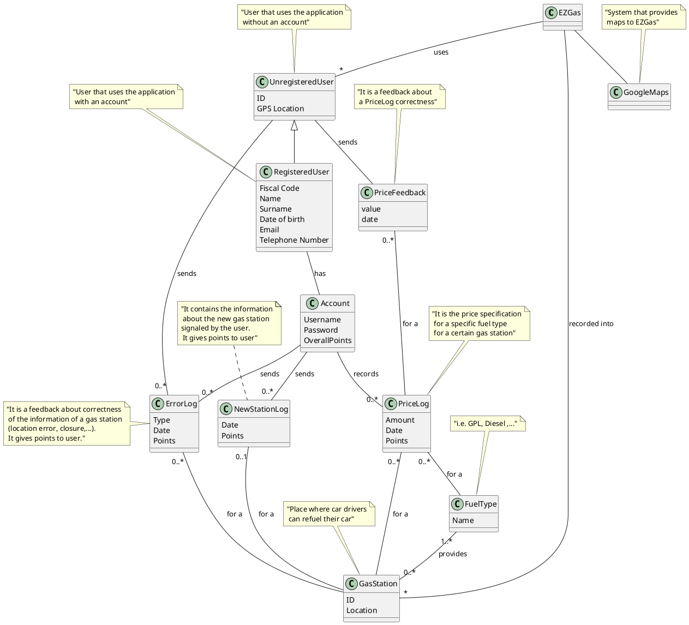
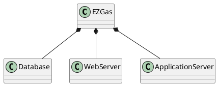
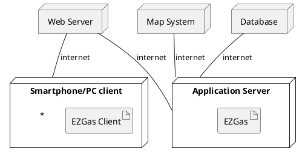

# Requirements Document 

Authors:

Date:

Version:

# Contents

- [Abstract](#abstract)
- [Stakeholders](#stakeholders)
- [Context Diagram and interfaces](#context-diagram-and-interfaces)
	+ [Context Diagram](#context-diagram)
	+ [Interfaces](#interfaces) 
	
- [Requirements Document](#requirements-document)
- [Contents](#contents)
- [Abstract](#abstract)
- [Stakeholders](#stakeholders)
- [Context Diagram and interfaces](#context-diagram-and-interfaces)
	- [Context Diagram](#context-diagram)
	- [Interfaces](#interfaces)
- [Stories and personas](#stories-and-personas)
- [Functional and non functional requirements](#functional-and-non-functional-requirements)
	- [Functional Requirements](#functional-requirements)
	- [Non Functional Requirements](#non-functional-requirements)
- [Use case diagram and use cases](#use-case-diagram-and-use-cases)
	- [Use case diagram](#use-case-diagram)
		- [Use case 1, UC1](#use-case-1-uc1)
				- [Scenario 1.1](#scenario-11)
				- [Scenario 1.2](#scenario-12)
				- [Scenario 1.3](#scenario-13)
		- [Use case 2, UC2](#use-case-2-uc2)
				- [Scenario 2.1](#scenario-21)
		- [Use case 3, UC3](#use-case-3-uc3)
				- [Scenario 3.1](#scenario-31)
		- [Use case 4, UC4](#use-case-4-uc4)
				- [Scenario 4.1](#scenario-41)
		- [Use case 5, UC5](#use-case-5-uc5)
				- [Scenario 5.1](#scenario-51)
		- [Use case 6, UC6](#use-case-6-uc6)
			- [Scenario 6.1](#scenario-61)
		- [Use case 7, UC7](#use-case-7-uc7)
			- [Scenario 7.1](#scenario-71)
		- [Use case 8, UC8](#use-case-8-uc8)
			- [Scenario 8.1](#scenario-81)
		- [Use case 9, UC9](#use-case-9-uc9)
			- [Scenario 9.1](#scenario-91)
		- [Use case 10, UC10](#use-case-10-uc10)
			- [Scenario 10.1](#scenario-101)
		- [Use case 11, UC11](#use-case-11-uc11)
			- [Scenario 11.1](#scenario-111)
- [Glossary](#glossary)
- [System Design](#system-design)
- [Deployment Diagram](#deployment-diagram)

# Abstract

Since cars have been invented, car owners have had the need to refill the fuel tank in order to make them move. Sometimes you know where you are goning to refuels, sometimes you don't. If you're travelling a long distance it will happen that you need to find a gas station, and probably you want to find the cheapest near. Car drivers need to know the different prices and precise position of gas stations in their neighboring area or in the middle of their road. In order to do this, they use EZGas that allow to:

1 - collect prices of fuels in different gas stations;

2 - locate gas stations in an area.

Each user can use the app also to send a feedback about reliability of informations of a specific gas station. If a user has also a registered account, he can set a new price for a specific fuel type for a certain gas station and possibly its location. By doing this, the registered user can collect point to obtain coupon. Moreover, a registered user can have a list of its favourite gas stations and receive a notifications if changes occur to those gas stations.


# Stakeholders


| Stakeholder name  | Description | 
| ----------------- |:-----------:|
| Unregistered User	|Can find a gas station based on its location or prices. Can also send a feedback about correctness of gas station data| 
| Registered User 	| Can insert/delete gas station and insert/modify fuel price. By doing this, it collects points to obtain coupon| 
| GoogleMaps	    |External service used to map user and gas stations|


# Context Diagram and interfaces

## Context Diagram


```plantuml
left to right direction
actor "Unregistered User" as uu
actor "Registered User" as ru
actor GoogleMaps as gm
uu -- (EZGas) 
ru -- (EZGas)
gm <=> (EZGas)
```

## Interfaces

| Actor | Logical Interface | Physical Interface  |
| ------------- |:-------------:| -----:|
| User (both types)	| GUI |Touchscreen     |
| GoogleMaps	    | API |Internet        |

# Stories and personas
\<A Persona is a realistic impersonation of an actor. Define here a few personas and describe in plain text how a persona interacts with the system>

\<Persona is-an-instance-of actor>

\<stories will be formalized later as use cases>

Tom is a bank worker who has been transferred in a office pretty far from his house. The bank has not provided Tom with a company car, so he must use his own vehicle. He would like to know what are the gas station in the middle of the road between his house and the bank and what are the ones with the lowest price. He also would like to communicate these informations to his colleagues and friends, in an efficient way. He discovers a new app, EZGas, where he can find gas stations located around his position and check their price. He can also leave a positive/negative feedback about the gas station. Moreover, he decides to register an account. By doing so, he can also signal errors about information of a gas station, insert fuel type price, insert a new gas station or signal a closure. In this way he obtains pointS that can be converted in coupon.  

Jess is a car driver that wants only saving her money for fuel. She would have a system to choose the cheapest gas station in the area where she is, but she is not interested in supporting this system. Therefore, she has not an account and she cannot update prices or notify the presence of a new gas station.

# Functional and non functional requirements

## Functional Requirements

<In the form DO SOMETHING, or VERB NOUN, describe high level capabilities of the system>

<will match to high level use cases>

| ID        | Description  |
| ------------- |:-------------:| 
|  FR1      |Manage operations of registration, log in and log out|  
|  FR2      |Every user can visualize informations of a gas station|
|  FR3      |Every user can visualize the list of the closest gas stations|             
|  FR4      |Every user can visualize the list of the cheapest gas stations|
|  FR5      |Every user can get from GoogleMaps the route to the selected gas station|
|  FR6      |Every user can send a feedback about data of a specific gas station|
|  FR7      |Registered user can insert a fuel type price for a gas station|
|  FR8	    |Registered user can signal a price error|
|  FR9      |Registered user can signal a location error|
|  FR10     |Registered user can add a new gas station|
|  FR11     |Registered user can signal a gas station closure|
|  FR12     |Registered user can see the points he collected and their equivalent money value in his wallet|
|  FR13     |Registered user can print the coupon|
|  FR14     |Registered user can delete his account|
|  FR15     |Registered user can update its profile and settings|
|  FR16     |Registered user can insert a gas station into a favourite list|

## Non Functional Requirements

<Describe constraints on functional requirements>

| ID        | Type (efficiency, reliability, ..)           | Description  | Refers to |
| ------------- |:-------------:| :-----:| -----:|
|  NFR1     | Performance   | All functions should be completed in < 0.5 sec  			                                           | All FR   |
|  NFR2     | Portability   | The application must be available on every OS 						                               | All FR   |
|  NFR3     | Functionality | Every user can send one feedback a day for each gas station                                          | FR6      |
|  NFR4     | Functionality | A feedback can be sent only if the user is located at most 3 km from the selected gas station        | FR6      |
|  NFR5     | Functionality | The user can search gas stations located in an area selected by the user itself directly on the map  | FR3, FR4 |
|  NFR6   | Localisation |Prices are expressed in EUR  | FR2, FR4, FR7, FR8, FR12, FR13 |
|  NFR7    | Usability | Send a notification to registered user when one of his favourites gas stations' price is updated |FR10, FR16 |
|  NFR8     | Usability | When a registered user insert a new gas station or notify a closure, it's necessary to attach a photo of the gas station and check if his location is around 500m|FR10, FR11|
|  NFR9	   | Localisation | Points are integer values |FR7, FR12|
|  NFR10     | Usability |Registered user receives points when he insert a new price. Points are computing according to this time parameter:  p= (timestamp_lastupdate-timestamp_now). The older the last update , the higher the number of points (p=24h -> 10 points; p=48h->15 points; ...) |FR7, FR12|
|  NFR11     | Usability |Registered user receives 50 points when the insert or the signal of closure of a gas station is correctly verified. |FR7, FR12|
| NFR12 | Usability | 100 points = 1 EUR | FR12, FR13|


# Use case diagram and use cases


## Use case diagram
\<define here UML Use case diagram UCD summarizing all use cases, and their relationships>

```plantuml
left to right direction
actor "Registered user" as ru
actor "Unregistered user" as uu
actor GoogleMaps as gm
uu -- (FR3 Visualize the closest gas stations)
uu -- (FR4 Visualize the cheapest gas stations)
(FR3 Visualize the closest gas stations) --> (FR2 Visualize gas station info)
(FR4 Visualize the cheapest gas stations) --> (FR2 Visualize gas station info)
(FR2 Visualize gas station info) --> (mp)
uu -- (FR6 Send a feedback)
ru --> uu
ru -- (FR7 Insert a fuel type price)
ru -- (FR8 Signal a price error)
ru -- (FR9 Signal a location error)
ru -- (FR10 Add a gas station)
ru -- (FR11 Signal a gas station closure)
ru -- (FR12 See the points collected)
(FR12 See the points collected) --> (FR13 Print a coupon)
ru -- (FR14 Delete account)
ru -- (FR15 Update profile)
ru -- (FR16 Insert a gas station into a favourite list)
(FR10 Add a gas station) --> (mp)
(FR11 Signal a gas station closure) --> (mp)
```

\<next describe here each use case in the UCD>
### Use case 1, UC1
Registration, login, logout

| Actors Involved        | Registered user |
| ------------- |:-------------:| 
|  Precondition     | |  
|  Post condition     | |
|  Nominal Scenario     | |
|  Variants     |in case of registration errors or login errors issue a warning |

##### Scenario 1.1 

Registration

| Scenario 1.1 | |
| ------------- |:-------------:| 
|  Precondition     | Account does not exist |
|  Post condition     | Account exists |
| Step#        | Description  |
|  1     | The user clicks to the registration button  |  
|  2     | He fills a form with all required informations |
|  3     |  He has an account |

##### Scenario 1.2

Login

| Scenario 1.2 | |
| ------------- |:-------------:| 
|  Precondition     | User is not logged in|
|  Post condition     | User is logged in |
| Step#        | Description  |
|  1     | The  user clicks to the login button  |  
|  2     | He inserts username and password |
|  3     |  He is logged |

##### Scenario 1.3

Logout

| Scenario 1.3 | |
| ------------- |:-------------:| 
|  Precondition     | User logged in|
|  Post condition     | User is not logged in |
| Step#        | Description  |
|  1     | The user clicks to the logout button  |  
|  3     |  He is not logged anymore |

### Use case 2, UC2

Visualize the list of gas stations

| Actors Involved        | User, Google Maps |
| ------------- |:-------------:| 
|  Precondition     | Map M exists, Gas stations' positions <= User position + 10 km |  
|  Post condition     |  |
|  Nominal Scenario     |The user opens the app, the map is retrieved by the map system and the gas stations (with their prices) are list on the map. |
|  Variants     | |

##### Scenario 2.1

| Scenario 2.1 | |
| ------------- |:-------------:| 
|  Precondition     | User GPS should be activated|
|  Post condition     | All the gas stations are in a range of 10 km around the user position |
| Step#        | Description  |
|  1     | The  user opens the app  |  
|  2     | The GPS signal is captured |
|  3     | The map is retrieved by GoogleMaps |
|  4     | The gas stations are selected and listed with their prices on the map|
|  5     | The cheapest and the most expensive gas stations are highlighted|

### Use case 3, UC3

Get the route 

| Actors Involved        | User, Google Maps |
| ------------- |:-------------:| 
|  Precondition     | Map M exists, Gas station G exists |  
|  Post condition     | User's location <= G's location + 500mt |
|  Nominal Scenario     |The user chooses a gas station on the list and the GoogleMaps system gets a route for it. |
|  Variants     | |

##### Scenario 3.1

| Scenario 3.1 | |
| ------------- |:-------------:| 
|  Precondition     | User GPS should be activated|
|  Post condition     | User's position <= G's position + 500mt |
| Step#        | Description  |
|  1     | The  user chooses a gas station G  |  
|  2     | The user presses the route button |
|  3     | User's location and G's location are sent to GoogleMaps  |
|  4     | GoogleMaps provides a route|
|  5     | User follows this route and he reaches the gas station G|

### Use case 4, UC4

Manage Feedback

| Actors Involved        | User |
| ------------- |:-------------:| 
|  Precondition     | Map M exists, Gas station G exists, User's location < G's location + 3 km, User has not already expressed a feedback for G on that day |  
|  Post condition     |User can no longer express a feedback for G on that day |
|  Nominal Scenario     |The user chooses a gas station in a range of 3km around him and he send a feedback (positive/negative) about the correctness of prices. |
|  Variants     | |

##### Scenario 4.1

| Scenario 4.1 | |
| ------------- |:-------------:| 
|  Precondition     |Map M exists, Gas station G exists, User's location < G's location + 3 km, User has not already expressed a feedback for G on that day|
|  Post condition     | User can no longer express a feedback for G on that day |
| Step#        | Description  |
|  1     | The  user chooses a gas station G  |  
|  2     | The user presses one of the feedback's buttons (up/down) |

### Use case 5, UC5

Manage Feedback

| Actors Involved        | User |
| ------------- |:-------------:| 
|  Precondition     | Map M exists, Gas station G exists, User's location < G's location + 3 km |  
|  Post condition     | |
|  Nominal Scenario     |The user chooses a gas station in a range of 3km around him and he notify an error about gas station's informations |
|  Variants     | |

##### Scenario 5.1

| Scenario 5.1 | |
| ------------- |:-------------:| 
|  Precondition     |Map M exists, Gas station G exists |
|  Post condition     | |
| Step#        | Description  |
|  1     | The  user choices a gas station G  |
|  2     | The user presses a button to signal an error |
|  3     | The user inserts all the information required about the error|

### Use case 6, UC6

Insert/modify a fuel type price for a gas station

| Actors Involved        | Registered User |
| ------------- |:-------------:| 
|  Precondition     | Log-in successful, User's location < G's location + 3 km |  
|  Post condition     | Gas station updated |
|  Nominal Scenario     |The registered user chooses a gas station in a range of 3km around him and inserts a fuel type price |
|  Variants     | Error message if log-in fails |

#### Scenario 6.1

| Scenario 6.1 | |
| ------------- |:-------------:| 
|  Precondition     |User has an account, Gas station G exists |
|  Post condition     | Data recorded |
| Step#        | Description  |
|  1     | The  user choices a gas station G  |
|  2     | The user presses a button to insert/modify a fuel type price |
|  3     | The user inserts all the informations needed |
|  4	 | New information are now available to every other user |
|  5	 | The registered user receives an amount of points base on rule in NFR10 | 

### Use case 7, UC7

Add a new gas station

| Actors Involved        | Registered User |
| ------------- |:-------------:| 
|  Precondition     | Log-in successful, User's location < Selected location + 500 m |  
|  Post condition     | Gas station inserted |
|  Nominal Scenario     | The registered user inserts a new gas station with as many information as possible, providing also a photo |
|  Variants     | Error message if log-in fails |

#### Scenario 7.1

| Scenario 7.1 | |
| ------------- |:-------------:| 
|  Precondition     |User has an account|
|  Post condition     | Data recorded |
| Step#        | Description  |
|  1     | The  user selects a point in the map where there should be a gas station  |
|  2     | The user presses a button to insert the gas station |
|  3     | The user inserts all the information needed, together with a photo |
|  4	 | New gas station now appears in the map to every other user |
|  5	 | Once existence of the gas station will be correctly verified, the user will receive 50 points |

### Use case 8, UC8

Signal a gas station closure

| Actors Involved        | Registered User |
| ------------- |:-------------:| 
|  Precondition     | Log-in successful & User's location < G' location + 500 m |  
|  Post condition     | Gas station signaled as closed |
|  Nominal Scenario     | The registered user signals a gas station closure, providing also a photo |
|  Variants     | Error message if log-in fails |

#### Scenario 8.1

| Scenario 8.1 | |
| ------------- |:-------------:| 
|  Precondition     |User has an account|
|  Post condition     | |
| Step#        | Description  |
|  1     | The  user selects a gas station in the map |
|  2     | The user presses a button to signal the closure of the gas station |
|  3     | The user provides also a photo |
|  4	 | If correctly verified, the gas station disappears from the map and the user receives 50 points |

### Use case 9, UC9

Delete an account

| Actors Involved        | Registered User |
| ------------- |:-------------:| 
|  Precondition     | Log-in successful |  
|  Post condition     | Account deleted |
|  Nominal Scenario     | The user selects delete option |
|  Variants     | Error message if log-in fails |

#### Scenario 9.1

| Scenario 9.1 | |
| ------------- |:-------------:| 
|  Precondition     |User has an account|
|  Post condition     | |
| Step#        | Description  |
|  1     | The  user selects setting and option |
|  2     | The user presses a button to delete his account |
|  3     | The user will no longer be able to log with the deleted profile |

### Use case 10, UC10

Update profile

| Actors Involved        | Registered User |
| ------------- |:-------------:| 
|  Precondition     | Log-in successful |  
|  Post condition     | Profile updated |
|  Nominal Scenario     | The user can modify different information like username, password, email, telephone number, date of birth |
|  Variants     | Error message if log-in fails |

#### Scenario 10.1

| Scenario 10.1 | |
| ------------- |:-------------:| 
|  Precondition     |User has an account|
|  Post condition     | |
| Step#        | Description  |
|  1     | The  user selects setting and option |
|  2     | The user presses a button to modify his profile information |
|  3     | Information updated |

### Use case 11, UC11

Insert gas station in the favourite list

| Actors Involved        | Registered User |
| ------------- |:-------------:| 
|  Precondition     | Log-in successful |  
|  Post condition     | Gas station appears in the favourite list |
|  Nominal Scenario     | The user selects a gas station and press the option 'add to favourite' |
|  Variants     | Error message if log-in fails |

#### Scenario 11.1

| Scenario 11.1 | |
| ------------- |:-------------:| 
|  Precondition     |User has an account, Gas station G exists |
|  Post condition     | List updated |
| Step#        | Description  |
|  1     | The  user selects a gas station from the map |
|  2     | The user presses a button to insert the gas station in the list of the favourite ones |
|  3     | The gas station will appear in the list |

# Glossary

# System Design




# Deployment Diagram 

